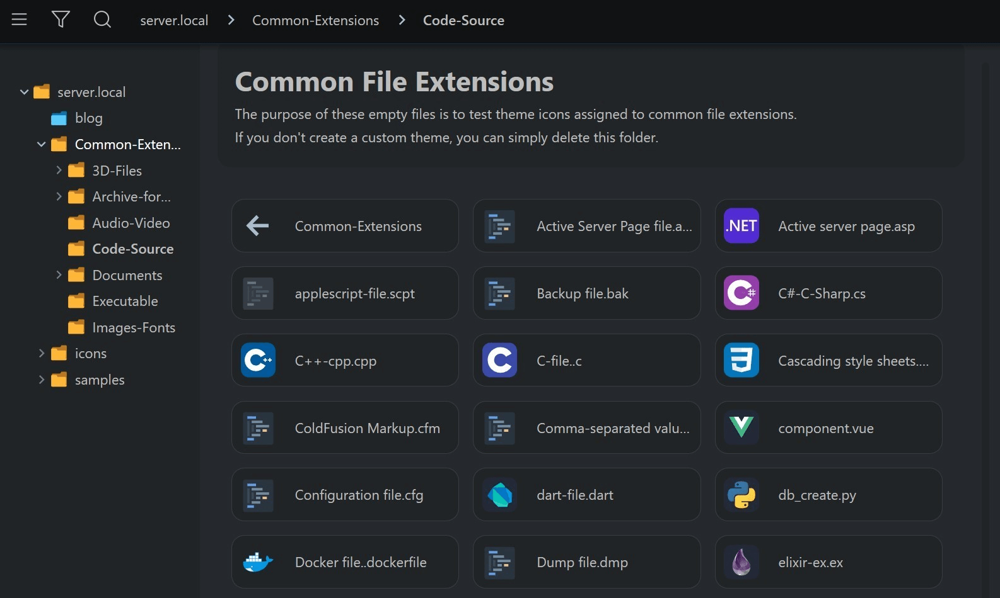

[![license][license-img]][github] [![web][web-img]][web] [![github][github-img]][github]

# Server Directory Index

Web server directory index customization with preview, pagination, download — h5ai.

## SDI — h5ai

Unpack server directory index h5ai to your `/www/public/*.*`   
and access your `https://example.com/public` or `http://localhost`

Whatever you drop on the Public folder will automatically
be available on the web server and you can easily share the links.

### 1. Server AutoIndex

Enables or disables automatic directory listing for directories missing an index page.

Add the public directory index to your server configuration.   
You can also redirect every access to the /public/ directory.   
See how to redirect [Apache httpd, lighttpd, and nginx][wiki] 

### 2. JavaScript Modules

Default server configuration does not serve <code>.mjs</code>   
PDF.js requires this Mime Type in your server configuration,   
otherwise you'll get a browser error :

> Failed to load module script: Expected a JavaScript module script but the server responded with a MIME type of "text/html"

See [Apache httpd, lighttpd, and nginx][wiki] to add <code>.mjs</code> JavaScript MIME type. 

---



---

## Development Note  

### SDI — CRUD

[Branch local][wiki] to create, read, upload and delete   
Authenticate using password-based Accounts.

* Do **not** install any files from the `sdi-crud` branch before   
 you set accounts and passwords to work correctly!
* Learn more detailed install instructions on the
  [project wiki][wiki].
* For bug reports and feature requests please use [issues][github-issues].


#### Build

There are installation ready packages for the latest [releases][release] and
[dev builds][develop].   
But to build **h5ai** yourself either `git clone` or
download SDI—CRUD.   

Change Node.js version with [Node Version Manager][nvm]  
Install the proposed node version locally [`node 16.17.0`][node]   
Cross-env tested on Linux and Windows,   
might work on other configurations.   

```sh
nvm install 16.17.0 
```

List node versions

```sh
nvm ls
```

and in order to use it:

```sh
nvm use 16.17.0
```

From within the root folder of sdi-crud run the following commands 

```sh
> npm install
> npm run build
```

Find a fresh zipball in folder `build` 


#### Development cross-env

Linux   

```sh
> npm run clean
> npm run reinstall
> npm run rebuild

```

Windows   

```sh
> npm run clean-win
> npm run reinstall-win
> npm run rebuild-win

```

## License

The MIT License (MIT)

**SDI**   
Copyright (c) 2024 Nuno Luciano (gigamaster)

**h5ai**   
Copyright (c) 2020 Lars Jung (<https://larsjung.de>)

Permission is hereby granted, free of charge, to any person obtaining a copy
of this software and associated documentation files (the "Software"), to deal
in the Software without restriction, including without limitation the rights
to use, copy, modify, merge, publish, distribute, sublicense, and/or sell
copies of the Software, and to permit persons to whom the Software is
furnished to do so, subject to the following conditions:

The above copyright notice and this permission notice shall be included in
all copies or substantial portions of the Software.

THE SOFTWARE IS PROVIDED "AS IS", WITHOUT WARRANTY OF ANY KIND, EXPRESS OR
IMPLIED, INCLUDING BUT NOT LIMITED TO THE WARRANTIES OF MERCHANTABILITY,
FITNESS FOR A PARTICULAR PURPOSE AND NONINFRINGEMENT. IN NO EVENT SHALL THE
AUTHORS OR COPYRIGHT HOLDERS BE LIABLE FOR ANY CLAIM, DAMAGES OR OTHER
LIABILITY, WHETHER IN AN ACTION OF CONTRACT, TORT OR OTHERWISE, ARISING FROM,
OUT OF OR IN CONNECTION WITH THE SOFTWARE OR THE USE OR OTHER DEALINGS IN
THE SOFTWARE.

## References

**h5ai** profits from other projects, all of them licensed under the MIT license
too. Exceptions are some [Material Design icons][material-design-icons] (CC BY 4.0).

[web]: https://github.com/gigamaster/server-directory-index
[wiki]: https://github.com/gigamaster/server-directory-index/wiki
[github]: https://github.com/gigamaster/server-directory-index
[github-issues]: https://github.com/gigamaster/server-directory-index/issues
[release]: https://github.com/gigamaster/server-directory-index/releases
[develop]: https://github.com/gigamaster/server-directory-index
[node]: https://nodejs.org
[nvm]: https://github.com/nvm-sh/nvm
[material-design-icons]: https://github.com/google/material-design-icons

[license-img]: https://img.shields.io/badge/license-MIT-a0a060.svg?style=flat-square
[web-img]: https://img.shields.io/badge/SDI-h5ai-a0a060?style=flat-square
[github-img]: https://img.shields.io/badge/github-gigamaster/sdi-a0a060.svg?style=flat-square
